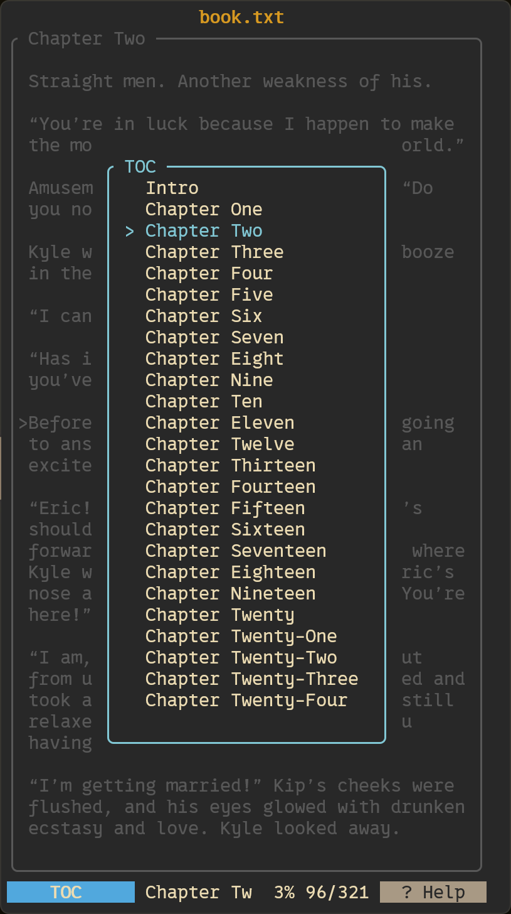
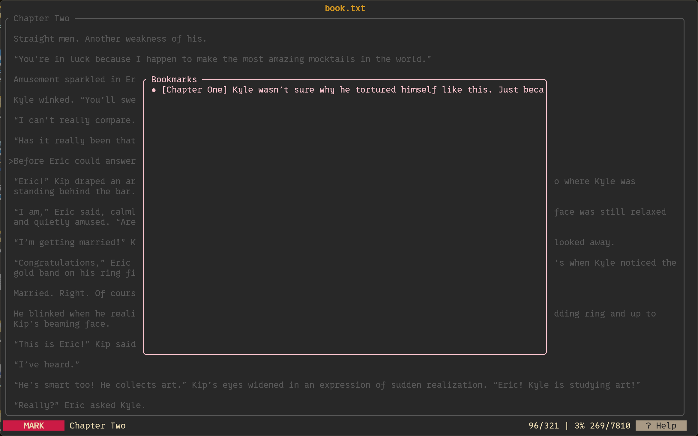
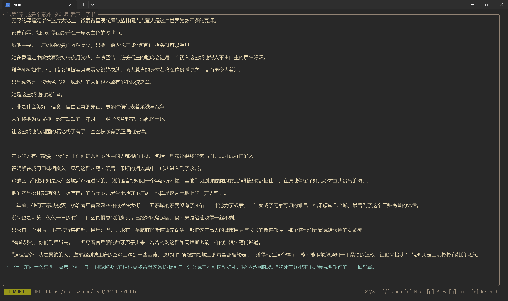

[English](./README.md) | [中文](./README_CN.md)

# Noveltui

A tui novel reader, Powered by [ratatui](https://github.com/ratatui/ratatui)

## Features 
- **Chapter Parsing**: Automatically detects and navigates chapters by regex and generate toc
- **Resume reading**: Press q to quit and auto mark a bookmark; next time you open the book, it jumps back to last bookmarks.
- **Bookmarks**: Add, remove, and manage bookmarks for easy navigation
- **Auto-Read Mode**: Hands-free reading with automatic scrolling
- **theme**: Change highlight color by `--theme`

## Installation

```bash
cargo install noveltui
# only install noveltui
cargo install noveltui --bin noveltui
```

## Build from Source
```bash
git clone https://github.com/minxuanz/noveltui.git
cd noveltui
cargo build --release
```

`target/release/noveltui` read from local txt

## Usage

```bash
./noveltui path/to/your/novel.txt
```

<details>
<summary>⚠️</summary>

```bash
./webnovel --url website
#e.g.
./webnovel --url https://ixdzs8.com/read/508569/p1.html
```
> Tips: webnovel only supoort `https://ixdzs8.com/` now, and need install chrome
</details>


## Supported 
### os
- windows
- linux
- macos   (not test)

### format & encoding
- txt (UTF-8, GBK, GB2312, etc.)


### Chapter Detection(noveltui)
You can pass `--regex <YOUR CUSTOM REGEX>` to parse title.
```bash
./noveltui --regex="^(\d+)([\u4e00-\u9fff0-9]+)$" path/to/your/novel.txt
``` 

### Keybindings(noveltui)

| Key          | Action                          |
|--------------|---------------------------------|
| `q`          | Add bookmark then Quit          |
| `Q`          | Quit                            |
| `j` / `↓`    | Scroll down                     |
| `k` / `↑`    | Scroll up                       |
| `n`          | Next Charpter                   |
| `p`          | Prev Charpter                   |
| `m`          | Toggle bookmark                 |
| `M`          | Delete all bookmarks            |
| `Space`      | Toggle auto-read mode           |
| `b`          | Toggle bookmark menu            |
| `t`          | Toggle toc                      |
| `ctrl` + `z` | Suspend (unix)                  |
| `l`          | Adjust line space               |  

<div align="center">


</div>

<div align="center">



</div>

<div align="center">

 

</div>


### webnovel (online read) (WIP)

<div align="center">


*webnovel*

</div>


## Contributing

Contributions are welcome! Please feel free to submit issues and pull requests.