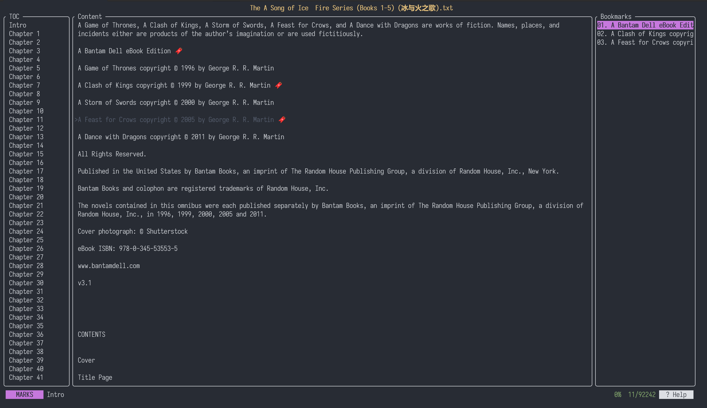
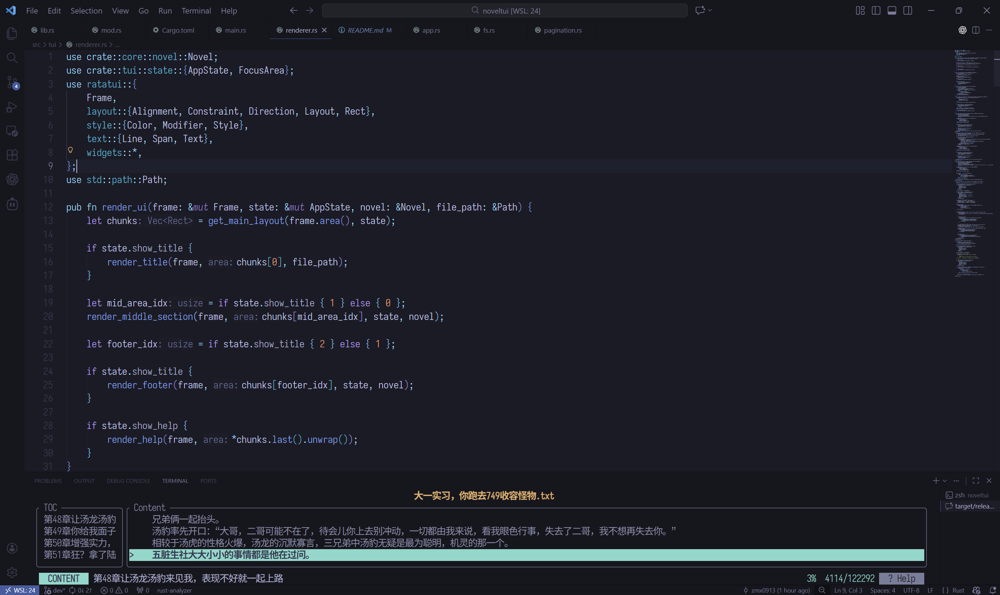
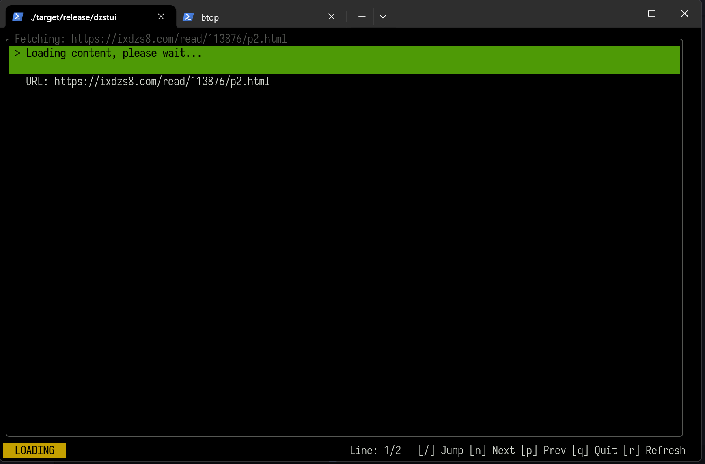
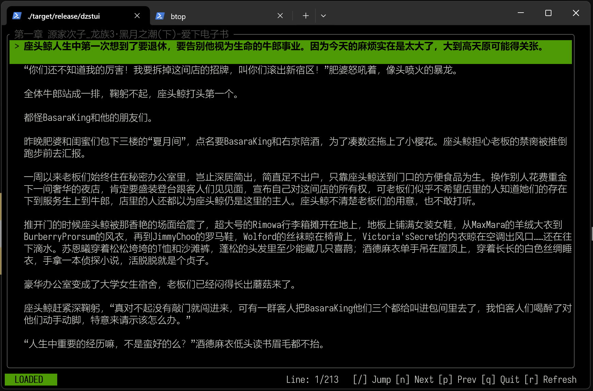

# Noveltui

A terminal-based novel reader, Powered by https://github.com/ratatui/ratatui
## Features

- **Text File Support**: Reads UTF-8, GBK, GB2312, and other encodings
- **Chapter Parsing**: Automatically detects and navigates chapters (e.g., "Chapter 1", "第1章", "CHAPTER SIX")
- **Bookmarks**: Add, remove, and manage bookmarks for easy navigation
- **Auto-Read Mode**: Hands-free reading with automatic scrolling

## Installation

### Build from Source
```bash
git clone https://github.com/minxuanz/noveltui.git
cd noveltui
cargo build --release
```

The binary will be available at `target/release/noveltui` for local read,
`target/release/dzstui` for online read.

## Usage

```bash
./noveltui path/to/your/novel.txt
# need install chrome 
./dzstui --url website
# e.g.
./dzstui --url https://ixdzs8.com/read/508569/p1.html
```

### Supported 
#### noveltui (local read)
- Plain text files (.txt)
- Various encodings (UTF-8, GBK, GB2312, etc.)

#### dzstui (online read) (WIP)
- Require: chrome
- Now only support ixdzs8.com

### Chapter Detection
The app automatically parses chapter titles using regex patterns:
- Chinese: `第[数字]章` (e.g., 第1章, 第一章)
- English: `Chapter [number]` (e.g., Chapter 1, CHAPTER SIX)

You can pass `--regex <YOUR CUSTOM REGEX>` to parse title.

## Keybindings

| Key          | Action                          |
|--------------|---------------------------------|
| `q`          | Quit                            |
| `Q`          | Add bookmark and quit           |
| `j` / `↓`    | Scroll down                     |
| `k` / `↑`    | Scroll up                       |
| `m`          | Toggle bookmark                 |
| `M`          | Delete all bookmarks            |
| `Space`      | Toggle auto-read mode           |
| `b`          | Open bookmark menu              |
| `→` / `l`    | Switch focus right              |
| `←` / `h`    | Switch focus left               |

## Screenshots





 

 

## Contributing

Contributions are welcome! Please feel free to submit issues and pull requests.