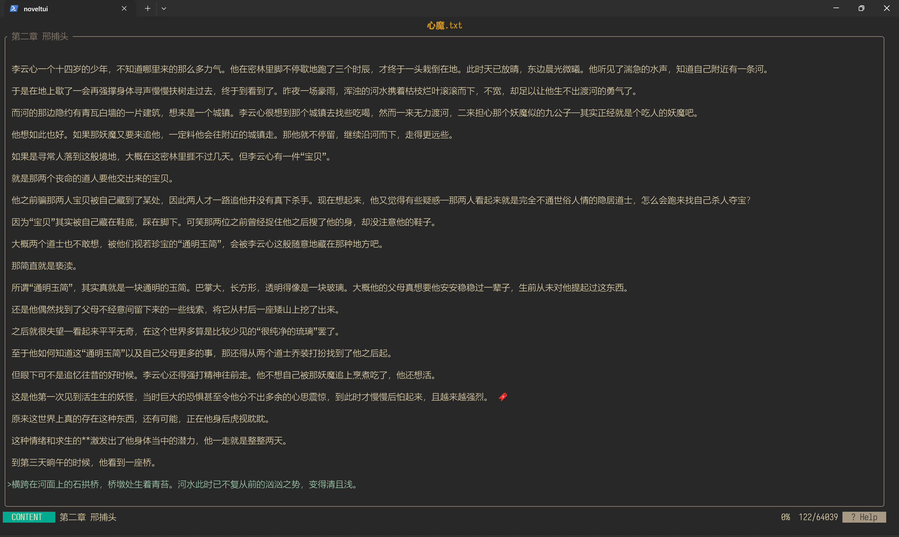
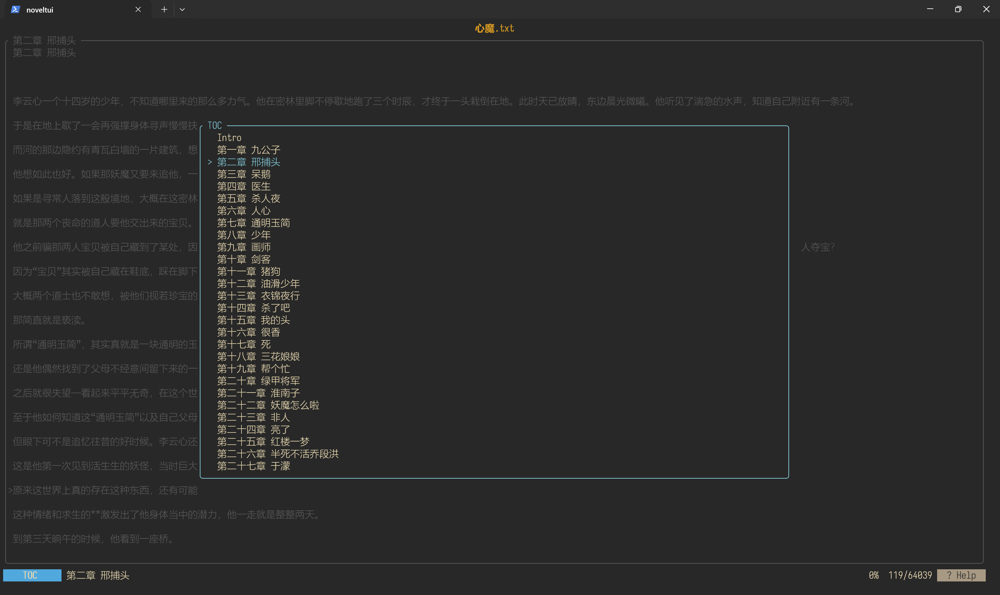
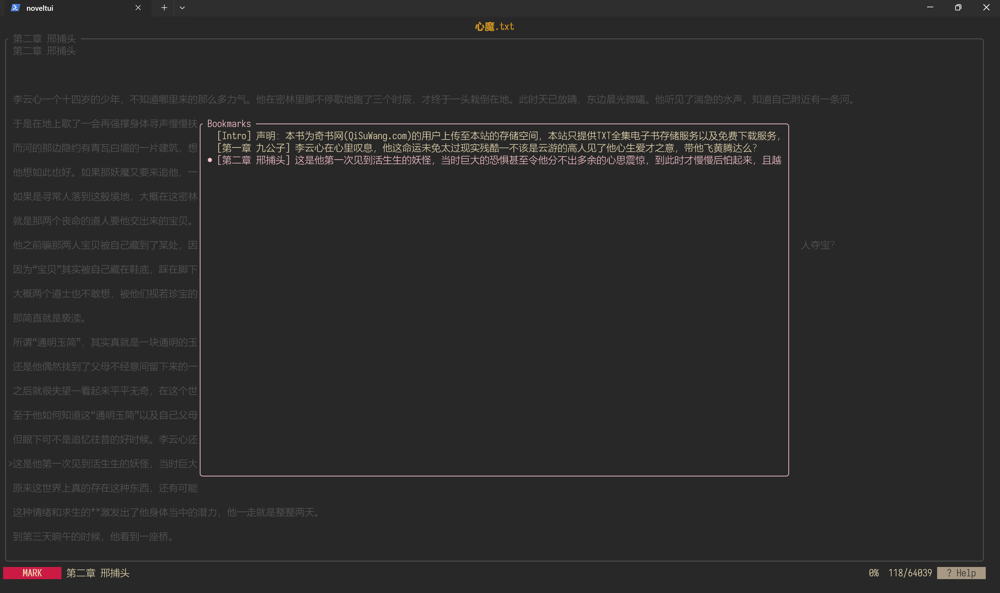
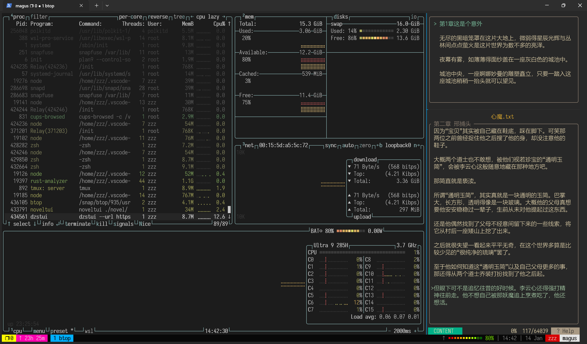

[English](./README.md) | [中文](./README_CN.md)

# Noveltui

一个基于终端界面的小说阅读器，由 [ratatui](https://github.com/ratatui/ratatui) 驱动。

适合配合tmux使用

## 功能特性
- **章节解析**：通过正则表达式自动检测章节并生成目录
- **书签管理**：添加、删除和管理书签，便于快速定位
- **记录上次阅读位置**：按q退出自动标记书签，下次阅读自动跳转
- **自动阅读模式**：无需手动翻页，自动滚动阅读
- **多主题**：通过`--theme`切换高亮颜色
- **在线阅读**：`webnovel` 支持从网站获取并阅读小说（开发中）

## 安装

```bash
cargo install noveltui
# only install noveltui
cargo install noveltui --bin noveltui
# only install webnovel
cargo insatll noveltui --bin webnovel
```

## 从源代码构建
```bash
git clone https://github.com/minxuanz/noveltui.git
cd noveltui
cargo build --release
```

`target/release/noveltui` 从本地txt文件阅读  
`target/release/webnovel` 从网站阅读

## 使用方法

```bash
./noveltui 小说路径.txt
```

```bash
./webnovel --url 网站地址
# 例如：
./webnovel --url https://ixdzs8.com/read/508569/p1.html
```
> 提示：目前 webnovel 仅支持 `https://ixdzs8.com/` 网站, 且需安装chrome浏览器

## 支持情况
### 操作系统
- Windows
- Linux
- macOS（未测试）

### 格式与编码
- txt 文件（支持 UTF-8、GBK、GB2312 等编码）

### 章节检测（noveltui）
可通过 `--regex <自定义正则表达式>` 来指定标题匹配规则。
```bash
./noveltui --regex="^(\d+)([\u4e00-\u9fff0-9]+)$" 小说路径.txt
```

### 快捷键（noveltui）

| 按键 | 操作 |
|------|------|
| `q` | 添加书签并退出 |
| `Q` | 直接退出 |
| `j` / `↓` | 向下滚动 |
| `k` / `↑` | 向上滚动 |
| `n` | 下一章 |
| `p` | 上一章 |
| `m` | 切换书签，按一次添加再按一次删除 |
| `M` | 删除所有书签 |
| `空格键` | 切换自动阅读模式 |
| `b` | 切换书签 |
| `t` | 切换目录 |
| `Ctrl` + `z` | 暂停程序(unix) |
| `l`          | 调整行距               | 

<div align="center">


*内容界面*

</div>

<div align="center">


*目录界面*

</div>

<div align="center">

 
*书签界面*

</div>

<div align="center">


*在 tmux 中运行*

</div>

### webnovel（在线阅读，开发中）

<div align="center">


</div>